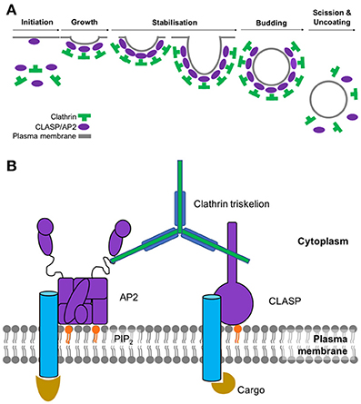
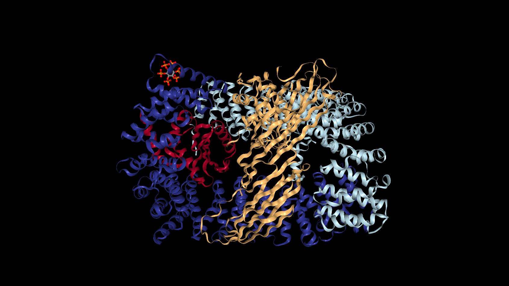

```{r setup, echo=TRUE, warning=FALSE, message=FALSE}
knitr::opts_chunk$set(echo = FALSE)
```


## Abstract

A short linear motif (SLiM) is a recurring pattern of approximately three to ten amino acids found in proteins. SLiMs are important for cellular signaling and the regulating of proteins, often times by acting as binding sites for protein-binding domains. While SLiMs exist both in ordered regions of proteins where there is a tertiary structure and in disordered regions where there is no structure, they are primarily functional in disordered regions. An important example of SLiM-mediated processes and the focus of this study is endocytosis. Endocytosis is the process by which cells engulf molecules from the extracellular environment. There are specific motifs that mediate and trigger endocytosis. However, the short length of motifs means that it is easy to overlook those that may be important to biological functions. The goal of this study is to identify previously unrecognized proteins that may be involved in endocytosis by analyzing the distribution of motifs in the ordered and disordered regions of the human proteome. Using a bioinformatics approach, we systematically searched the entire human proteome for motifs known to be involved in endocytosis. We hypothesize that the proteins we find to be enriched with motifs in disordered regions may be functionally important for endocytosis. These proteins will be targeted for experimental validation. 

## Introduction

Endocytosis is the process by which cells engulf molecules from the extracellular environment.
Clathrin-mediated endocytosis (CME) is a fundamental cellular pathway by which transmembrance receptors and their cargo are taken up into intracellular compartments (8). This type of endocytosis is named for its dependance on the protein clathrin which interacts with adaptor proteins during the formation of a clathrin-coated vesicle and the selection of cargo for internalization (8). Since, clathrin cannot directly interact with lipids or proteins of the plasma membrane, the adaptor proteins assist in the assembly of clathrin-coated vesicles by providing a link between clathrin and the membrane-bound cargo (8). The main adaptor protein that clathrin interacts with at the plasma membrane is adaptor protein 2 (AP2). The proposed clathrin-mediated endocytic pathway is depicted in Figure 1. 

```{r, echo=TRUE, warning=FALSE, message=FALSE, fig.cap="Figure 1A: Assembly and disassembly of the clathrin-coated pit. Figure 1B: Important companents involved in the initaition of clathrin=mediated endocytosis. The extracellular ligands is internalized when they bind to their transmembrane receptor. AP2 binds to the receptors at the intracellular side of the plasma membrane and to phosphatidylinositol 4,5-bisphosphate (PIP2) found in the inner membrane. AP2 also recruits clathrin triskelions (green) to the active endocytic site where polymerization results in the formation of the clathrin coat surrounding the pit.  ", out.width = '75%'}

```

<br>

Small functional signal motifs have become an essential part of studying endocytosis. These signal motifs are usually four to seven amino-acid residues long, and of those, the most functional important ones seem to be the bulky hydrophobic and charged amino acid residues (6). This is because of their suggested role in determining the specificity and the endocytic functional significance of the internalization and trafficking of transmembrane receptors and proteins (6). There are specific motifs that mediate and trigger endocytosis. However, the short length of motifs means that it is easy to overlook those that may be important to biological functions. Motifs have previously been found to be embedded and primarily functional in disordered regions, which are polypeptide segments that lack a tertiary structure due to having insufficient hydrophobic amino acids (12). The same cannot be said for motifs found in the ordered regions, polypeptide segments that do have a tertiary structure, in proteins. The goal of this study is to identify previously unrecognized proteins that may be involved in endocytosis by analyzing the ratio distribution of motifs in the ordered and disordered regions of the human proteome. It is already known that certain motifs play a specific role in recruitment in CME, such as $YXX\Phi$ and $[DE]XXXL[LI]$ which are motifs on transmembrane cargo proteins responsible for internalization (4), and $NPXY$ which recruits clathrin and adaptor protein molecules and acts as a recognition site for cargo to be delivered to endosomes and lysosomes (6). This known information allows us to use these motifs as the main focus of our study, and also allows us to examine their distributions in known endocytic proteins to give us an idea of what we are looking for. Overall our findings show the ratio of lowest motif count, for each motif, in proteins across the human proteome. This will allow us to identify and target any unrecognized interesting proteins that should be experimentally validated for possible endocytic functionality. 

## Results

###Background

We chose to focus on five proteins which are specifically involved in forming clathrin-coated pits for cargo intake in endocytosis: AP2A1, AP2A2, AP2B1, AP2S1 and AP2M1. According to Koscielny et al., these are, respectively, the 5 subunits of the AP2 protein (depicted in the figure 2 below), which trigger clathrin coated pit formation for the binding of cargo, plasma membrane, clathrin, and other accessory proteins (5). AAK1 is the AP2 associated kinase which phosphorylates this clathrin-mediated endocytosis and will also be included in our study (2). To be more specific, the activation of Adaptor Protein 2 complex occurs due to the hierarchial binding of the AP2A1, AP2A2, AP2B1, and AP2S1 subunits to phosphatidylinositol-4,5-bisphosphate (PIP2). The stabilization of these active complexes occurs via AP2M1 binding to PIP2 and interactions with $YXX\Phi$-containing cargo (4). 

```{r pressure, echo=TRUE, warning=FALSE, message=FALSE, fig.cap="Figure 2: The AP2 Protein Adaptor Complex, colored by its subunits: AP2A, AP2B1, AP2S1, AP2M1 (7)", out.width = '75%'}

```

<br>

Table 1 shows us the motifs we chose to focus on, their known function, and the reference where the function was found. When studying motifs, it is important to note that the 'X' character represents a wild card position where any amino acid can be recognized, the [] around multiple letters as in YXX[LIMFV] means that any of the amino acids in that group of letters can satisfy the expression, and the $\Phi$ symbol represents [LIMFV] which are the hydophobic amino acids (1). Meanwhile, the proteins proteins names in the above paragraph can be found in Table 2, along with the count of instances in seven motifs that have also been determined to be involved in endocytosis. The counts are separated to represent disordered verus ordered regions of each protein (obtained from our results and from the Eukaryotic Linear Motif database)(3).


Motif  |  Known Function  | Reference
| ---------- |:------------------------:| --------------------------:|
| $YXX[LIMFV]$ | This endocytic motif is a sorting signal that interacts with the AP2M1 subunit of the Adaptor Protein complex. It also directs the traffic of the endosomal and secretory pathways. | http://elm.eu.org/elms/TRG_ENDOCYTIC_2 |
| $X[DE]XXXL[LI]$ | This targeting motif is responsible for the sorting and internalization signals that direct transmembrane proteins from the cell surface. It interacts with AP2 which we know is involved in endocytosis at the plasma membrane. | http://elm.eu.org/elms/TRG_LysEnd_APsAcLL_1 |
| $[ST]XXXX[LI]$ | This is a cyclin docking motif that acts as a substrate recognition site for cyclin, thereby increasing phosphorylation by cyclin/Cdk complexes.  | http://elm.eu.org/elms/DOC_CYCLIN_RxL_1 |
| $FXDX[LIMFV]$  | This motif is an alpha appendage binding sequence found in proteins that are needed for clathrin coat assembly. It mediates the binding of amphipysin, AP180 and synaptojanin170 to the alpha subunit of AP2. | http://elm.eu.org/elms/LIG_AP2alpha_1 |
| $DX[FW]$  | This motif binds the appendage of the alpha and beta subunits of AP2, thus allowing for their recruitment to the site for the formation of the clathrin coated pit in endocytosis. | http://elm.eu.org/elms/LIG_AP2alpha_2 |
| $NPXY$  | This motif is a Phosphotyrosine binding (PTB) domain that binds to a phosphorylated version of NPXY. Hence, this motif is strongly associated with endocytic signalling. | http://elm.eu.org/elms/LIG_PTB_Apo_2 |
| $NPF$  | This motif is responsible for binding to the Eps15 homology (EH) domain. EH domains are only found in endocytic proteins and proteins involved in vesicular trafficking and are therefore believed to regulate these processes. | http://elm.eu.org/elms/LIG_EH_1 |


|UNIPROT Protein Name (ID)| Known Active Motif | Observed Motif Count (Disordered/Ordered) | Recorded ELM Motif Count (Disordered/Ordered)
| ------------ |:----------:| :---------------:| :------------: |
|AP2A1 (O95782) | $X[DE]XXXL[LI]$ | 0/1 |  |
|AP2A1 (O95782)|  $YXX[LIMFV]$ | 0/1 |  |
|AP2A1 (O95782)|  $[ST]XXXX[LI]$ | 3/1 |  |
|AP2A1 (O95782)|  $DX[FW]$ | 1/1 |  |
|AP2A2 (O94973)|  $X[DE]XXXL[LI]$ | 0/1 |  |
|AP2A2 (O94973)|  $YXX[LIMFV]$ | 0/1 |  |
|AP2A2 (O94973)|  $[ST]XXXX[LI]$ | 5/2 |  |
|AP2A2 (O94973)|  $DX[FW]$ | 1/1 |  |
|AP2B1 (P63010)|  $X[DE]XXXL[LI]$ | 0/1 |  |
|AP2B1 (P63010)|  $YXX[LIMFV]$ | 0/1 |  |
|AP2B1 (P63010)|  $[ST]XXXX[LI]$ | 1/1 |  |
|AP2B1 (P63010)|  $DX[FW]$ | 0/1 |  |
|AP2M1 (Q96CW1)|  $X[DE]XXXL[LI]$ | 0/1 |  |
|AP2M1 (Q96CW1)|  $YXX[LIMFV]$ | 0/1 |  |
|AP2M1 (Q96CW1)|  $[ST]XXXX[LI]$ | 1/0 |  |
|AP2M1 (Q96CW1)|  $DX[FW]$ | 0/1 |  |
|AP2M1 (Q96CW1)|  $FXDX[LIMFV]$ | 0/1 |  |
|AP2S1 (P53680)|  $YXX[LIMFV]$ | 0/3 |  |
|AAK1  (Q2M2I8)|  $X[DE]XXXL[LI]$ | 2/0 |  |
|AAK1  (Q2M2I8)|  $YXX[LIMFV]$ | 0/1 |  |
|AAK1  (Q2M2I8)|  $[ST]XXXX[LI]$ | 16/1 |  |
|AAK1  (Q2M2I8)|  $DX[FW]$ | 5/1 |  |


```{r, echo=TRUE, warning=FALSE, message=FALSE}
library(tidyverse)
library(scales)
library(cowplot)
library(ggrepel)
library(ggpubr)

data <- read_csv("human_proteome_motifs_across_domains.csv")
endo_data <- read_csv("endocytosis_involved_proteins.csv")
data <- rename(data, UNIPROT_ID = sequence_id)
data %>%
  filter(UNIPROT_ID == "O95782" | UNIPROT_ID == "O94973" | UNIPROT_ID == "P63010" | UNIPROT_ID == "P53680" | UNIPROT_ID == "Q96CW1" | UNIPROT_ID == "Q2M2I8") %>%
  inner_join(endo_data, by = c('UNIPROT_ID')) %>%
  group_by(UNIPROT_ID,UNIPROT_name,motif_type,domain_type) %>%
  summarize(count = n()) %>%
  spread(domain_type, count) %>%
  replace_na(list(D = 0, O = 0))%>%
  filter(motif_type %in% c("DX[FW]","X[DE]XXXL[LI]","YXX[LIMFV]", "NPXY","[ST]XXXX[LI]","FXDX[FILMV]", "NPF")) %>%
  ggplot(aes(x = O, y = D)) + 
  scale_x_continuous("Motif Count in Ordered Regions", breaks = pretty_breaks()) +
  scale_y_continuous("Motif Count in Disordered Regions", breaks = pretty_breaks()) +
  geom_point(stat = "identity") +
  geom_abline(color="red") + 
  geom_text_repel(aes(label=UNIPROT_name)) +
  facet_wrap(~motif_type, ncol = 2)
  
```

This plot shows the proteins and their motif count ratios in the specified motifs known to be involved in endocytosis. Proteins located above the red line are considered enriched in the disordered regions, those below the red line are considered enriched in the ordered regions, and those on the red line are not enriched in either region. This plot shows that the proteins we determined to be active in endocytosis are enriched in motif count in the ordered regions in the motifs $YXX[LIMFV]$ and $X[DE]XXL[LI]$ (with the exception of the AAK1 protein kinase which is enriched in motif count in the disordered regions for the $X[DE]XXXL[LI]$ motif). In the $[ST]XXXX[LI]$ all the proteins except the AP2B1 protein are enriched in the disordered regions. In the $DX[FW]$ motif, the AP2M1 and AP2B1 proteins are enriched in the ordered regions, while the AAK1 protein is enriched in the disordered region. Lastly, the AP2M1 protein is enriched in the ordered region for the $FXDX[LIMFV]$ motif. 

###Findings
In the Results section, we further show the top ten proteins that we have found to be enriched in the disordered regions for each motif, that is the proteins with the lowest count in the ordered regions compared to the disordered regions. Each table in this section is headed by the specific motif the table focuses on and has five columns to represent the following:

i. The UNIPROT accession ID for each protein enriched in the number of specified motifs in the disordered region
ii. The UNIPROT name for each protein
iii. The ratio of motif counts in the disordered versus ordered regions
iv. Whether or not the protein has been validated and recorded in the Eukaryoitic Linear Motif Database (3). 

The plot following each table represents a heatmap of proteins organized by the distribution of specific motifs in the disordered and ordered regions. The motifs specified were chosen based on their known activity in endocytosis, validated by the Eukaryoutic Linear Motif Database (ELM) as follows: $X[DE]XXXL[LI]$, $YXX[LIMFV]$, $NPXY$, $FXDX[LIMFV]$, $DX[FW]$, $[ST]XXXX[LI]$ and $NPF$ (3). The following motifs were further validated by Pandey: $X[DE]XXXL[LI]$, $YXX[LIMFV]$, $NPXY$, and $NPF$ (6). The AP2 adaptor complex is known to recognize the $YXX\Phi$ and $X[DE]XXXL[LI]$ endocytic signal motifs within the cytosolic tails of the transmembrane cargoes (11). In order to study each motif separately, heatmaps and tables were produced for each specific motif. Each hexagon on the heatmaps is labeled with a white number representing the number of proteins that have the same number of motif instances in the ordered and disordered regions, while the red line is a one to one line used to determine which proteins are enriched in the disordered regions and should be targeted based on our hypothesis. Proteins found most above the red line are those that we want to target. 

<br>

```{r, echo=TRUE, warning=FALSE, message=FALSE}

data <- rename(data, sequence_id = UNIPROT_ID)
filter_count <- function(data, motif) {
  data %>%
  group_by(sequence_id,domain_type,motif_type) %>%
  summarize(count = n()) %>%
  spread(domain_type, count) %>%
  replace_na(list(D = 0, O = 0)) %>%
  arrange(desc(D)) %>%
  filter(motif_type == !!motif)
}

filter_plot <- function(data,motif,number,numx,numy) {
  data %>%
  filter(D > 0) %>%
  ggplot(aes(x = O, y = D)) + 
  scale_x_continuous("Motif Count in Ordered Regions", breaks = pretty_breaks(n = numx), limits=c(0,numx)) +
  scale_y_continuous("Motif Count in Disordered Regions", breaks = pretty_breaks(n = numy), limits=c(0,numy)) +
  labs(title = paste0(motif, " motif counts in protein regions")) +
  geom_hex(bins = number) +
  geom_abline(color="green") + 
  stat_binhex(aes(label=..count..), geom="text", bins=number, colour="white", size=3.5) +
  scale_fill_gradientn(colours=c("red","black"),name = "Frequency",na.value=NA) +
  grids(linetype = "dashed")
}

```

#####In this section, the $YXX[LIMFV]$ motif was investigated. The $YXX\Phi$ motif is a sorting signal that interacts with the mu subunit of the Adaptor Protein complex. 


```{r, echo=TRUE, warning=FALSE, message=FALSE}
YXX <- filter_count(data, quo("YXX[LIMFV]"))
filter_plot(YXX, "YXX[LIMFV]", 15, 10, 18)
```

This plot shows the distribution of $YXX[LIMFV]$ motif counts in the ordered versus disordered regions in proteins across the human proteome. The table below displays the top ten proteins found to have the lowest count in ordered regions to disordered regions ratio. They represent the upper points on the plot above. 

<br>

##### $YXX[LIMFV]$ table
| UNIPROT name | UNIPROT accession ID | motif count in disordered regions | motif count in ordered regions | Recorded in Eukaryotic Linear Motif Database|
| :------- |:--------:|:--------:| :--------:| :---------------------------------------:|
| IRS2 | Q9Y4H2  | 17  | 1 | no |
| IRS1 | P35568  | 14  | 0 | no |
| SEC24B | O95487  | 11  | 2 | no |
| PRRC2A | P48634  | 10  | 0 | no |
| MUC16  | Q8WXI7  | 10  | 1 | no |
| R3HDM2 | B5MCU0  | 9  | 1 | no |
| IRS4 | O14654  | 9  | 1 | no |
| MAP1B | P46821 | 9  | 1 | no |
| PAG1 | Q9NWQ8  | 9  | 0 | no |
| ERBB3 | B3KWG5 | 8  | 1 | no |


<br>

##### In this section, the $NPF$ motif was investigated. This motif is responsible for binding to the Eps15 homology (EH) domain. EH domains are only found in endocytic proteins and believed to regulate endocytosis.

```{r, echo=TRUE, warning=FALSE, message=FALSE}
NPF <- filter_count(data, quo("NPF"))
filter_plot(NPF, "NPF", 12, 3, 5)
```

This plot shows the distribution of $NPF$ motif counts in the ordered versus disordered regions in proteins across the human proteome. The table below displays the top ten proteins found to have the lowest count in ordered regions to disordered regions ratio. They represent the upper points on the plot above. 

<br>

##### $NPF$ table
| UNIPROT name | UNIPROT accession ID | motif count in disordered regions | motif count in ordered regions | Recorded in Eukaryotic Linear Motif Database|
| ------- |:--------:|:--------:| :--------:| :---------------------------------------:|
| RBSN | Q9H1K0  | 6  | 0 | yes, in Rabenosyn-5 which is an effector protein that plays a role in early endocytic membrane fusion* |
| EHBP1 | Q8NDI1  | 5  | 0 | yes, in EH domain-binding protein 1 which links clathrin-mediated endocytosis to the actin cytoskeleton* |
| DAB2 | P98082  | 4  | 0 | no |
| SYNJ1 | A0A0D9SGJ6  | 3  | 0 | no |
| PACSIN2 | A0A0U1RR22  | 3  | 0 | no |
| RAB11FIP5 | A0A1B0GTL5  | 3  | 0 | no |
| AGFG1 | B8ZZY2 | 3  | 0 | no |
| SCAMP2 | H3BN93 | 3  | 0 | no |
| EPN1 | Q9Y6I3  | 3  | 0 | yes, in Epsin-1 which assists in the formation of the clathrin-coated pit for endocytosis* |
| EPN2 | O95208 | 3  | 0  | yes, in Epsin-2 which plays a role in the formation of clathrin-coated pit* |

<br>

##### In this section, the $X[DE]XXXL[LI]$ motif was investigated. This is a targeting motif that is responsible for the sorting and internalization signals that interact with AP2. 

```{r, echo=TRUE, warning=FALSE, message=FALSE}
XD <- filter_count(data, quo("X[DE]XXXL[LI]")) 
filter_plot(XD, "X[DE]XXXL[LI]", 15, 10, 18)
```

This plot shows the distribution of $X[DE]XXXL[LI]$ motif counts in the ordered versus disordered regions in proteins across the human proteome. The table below displays the top ten proteins found to have the lowest count in ordered regions to disordered regions ratio. They represent the upper points on the plot above. 

<br>

##### $X[DE]XXXL[LI]$ table
| UNIPROT name | UNIPROT accession ID | motif count in disordered regions | motif count in ordered regions | Recorded in Eukaryotic Linear Motif Database|
| ------- |:--------:| :--------:| :---------------------------------------:|
| TCHH | Q07283  | 14  | 1 | no |
| Uncharacterized protein FLJ40521 | Q8N7P7  | 12  | 0 | no |
| GOLGA6L4 | A6NEF3  | 11  | 0 | no |
| CCDC136 | Q96JN2  | 11  | 0 | no |
| MUC17 | E7EPM4  | 9  | 0 | no |
| GOLGA6L3 | A6NEY3  | 7  | 0 | no |
| MYH7B | A0A087X0T3  | 6  | 0 | no |
| MUC4 | A0A0G2JQI2  | 6  | 0 | no |
| JAKMIP1 | F2Z2K5 | 6  | 0 | no |
| SCEL | O95171 | 6  | 0 | no |


<br>

##### In this section, the $NPXY$ motif was investigated. This is a motif that acts as a Phosphotyrosine binding (PTB) domain to bind to a phosphorylated motif. 

```{r, echo=TRUE, warning=FALSE, message=FALSE}
NPXY <- filter_count(data, quo("NPXY"))
filter_plot(NPXY, "NPXY", 15, 10, 18)
```

This plot shows the distribution of $NPXY$ motif counts in the ordered versus disordered regions in proteins across the human proteome. The table below displays the top ten proteins found to have the lowest count in ordered regions to disordered regions ratio. They represent the upper points on the plot above. 
<br>

##### $NPXY$ table
| UNIPROT name | UNIPROT accession ID | motif count in disordered regions | motif count in ordered regions | Recorded in Eukaryotic Linear Motif Database|
| ------- |:--------:| :--------:| :---------------------------------------:|
| EGFR | E9PFD7  | 3  | 0 | no |
| TMC5 | F5GYU8  | 3  | 0 | no |
| CALR | K7EJB9  | 3  | 0 | no |
| CLGN | O14967  | 3  | 0 | no |
| ERBB2 | B4DTR1 | 2  | 0 | no |
| CEP41 | F8WAV3 | 2  | 0 | no |
| MALRD1 | H0Y3D6 | 2  | 0 | no |
| INPP5D | H0Y5Q9 | 2  | 0 | no |
| ITGB1 | H7C4K3 | 2  | 0 | no | 
| CASC3 | O15234 | 2  | 0 | no | 


<br>

##### In this section, the $FXDX[LIMFV]$ motif was investigated. The $FXDX\Phi$ motif mediates the binding of amphipysin, AP180 and synaptojanin170 to the alpha subunit of AP2 (necessary for clathrin coat assembly).

```{r, echo=TRUE, warning=FALSE, message=FALSE}
FXDX <- filter_count(data, quo("FXDX[FILMV]"))
filter_plot(FXDX, "FXDX[FILMV]", 8, 5, 5)
```

This plot shows the distribution of $FXDX[LIMFV]$ motif counts in the ordered versus disordered regions in proteins across the human proteome. The table below displays the top ten proteins found to have the lowest count in ordered regions to disordered regions ratio. They represent the upper points on the plot above. 

<br>

##### $FXDX[LIMFV]$ table
| UNIPROT name | UNIPROT accession ID | motif count in disordered regions | motif count in ordered regions | Recorded in Eukaryotic Linear Motif Database|
| :------- |:--------:| :--------:| :---------------------------------------:|
| WASHC2A | A0A087WYF6 | 6 | 0 | no |
| WASHC2C | A0A096LPC5 | 6 | 0 | no |
| WASHC2D | Q5SRD0 | 4 | 0 | no |
| SNAP91 | E9PDG8 | 3 | 1 | no |
| HIVEP1 | F5H212 | 3 | 0 | no |
| SNAP91 | O60641 | 3 | 1 | yes, there are 3 recorded in the clathrin coat assembly protein AP180* |
| CSNK2A1 | A0A087WY74 | 2 | 0 | no |
| GPSM1 | A0A0A0MRC4 | 2 | 0 | no |
| STX1A | A0A0C4DFZ1 | 2 | 0 | no |
| DNAJB6 | A0A0J9YX62 | 2 | 0 | no |

<br>


##### In this section, the $DX[FW]$ motif was investigated. This motif binds the appendage of the alpha and beta subunits of AP2, thus allowing for their recruitment to the site for the formation of the clathrin coated pit in endocytosis.

```{r, echo=TRUE, warning=FALSE, message=FALSE}
DX <- filter_count(data, quo("DX[FW]"))
filter_plot(DX, "DX[FW]", 15, 8, 20)
```

This plot shows the distribution of $DX[FW]$ motif counts in the ordered versus disordered regions in proteins across the human proteome. The table below displays the top ten proteins found to have the lowest count in ordered regions to disordered regions ratio. They represent the upper points on the plot above. 

<br>

##### $DX[FW]$ table
| UNIPROT name | UNIPROT accession ID | motif count in disordered regions | motif count in ordered regions | Recorded in Eukaryotic Linear Motif Database|
| :------- |:--------:| :--------:| :---------------------------------------:|
| EPS15L1 | Q9UBC2 | 23 | 0 | yes, there are 20 instances recorded in the epidermal growth factor receptor substrate 15-like 1, which seems to be a component of endocytic clathrin-coated pits and involved in endocytosis of integrin beta-1 and transferrin receptor. |
| WASHC2A | A0A087WYF6 | 22 | 0 | no |
| WASHC2C | A0A096LPC5 | 21 | 0 | no |
| EPS15 | P42566 | 17 | 2 | yes, there are 15 instances recorded in Epidermal growth factor receptor substrate 15 which plays multiple roles in clathrin=mediated endocytosis* |
| SNAP91 | E9PDG8| 13 | 0 | no |
| KMT2D | O14686 | 11 | 1 | no |
| DAB2 | P98082 | 10 | 1 | yes, there are 2 instances recorded in Disabled homolog 2, which is an adaptor protein that acts as a clathrin-associated sorting protein.* |
| EPN1 | Q9Y6I3 | 10 | 0 | no |
| WASHC2D | Q5SRD0 | 8 | 0 | no |
| EIF3A | Q14152 | 7 | 1 | no |

<br>

##### In this section, the $[ST]XXXX[LI]$ motif was investigated. This is a cyclin docking motif, thereby increasing phosphorylation by cyclin/Cdk complexes.

```{r, echo=TRUE, warning=FALSE, message=FALSE}
ST <- filter_count(data, quo("[ST]XXXX[LI]"))
filter_plot(ST, "[ST]XXXX[LI]", 15, 10, 30)
```

This plot shows the distribution of $[ST]XXXX[LI]$ motif counts in the ordered versus disordered regions in proteins across the human proteome. The table below displays the top ten proteins found to have the lowest count in ordered regions to disordered regions ratio. They represent the upper points on the plot above. 

<br>

##### $[ST]XXXX[LI]$ table
| UNIPROT name | UNIPROT accession ID | motif count in disordered regions | motif count in ordered regions | Recorded in Eukaryotic Linear Motif Database|
| :------- |:--------:| :--------:| :---------------------------------------:|
| MUC19 | Q7Z5P9 | 119 | 1 | no |
| MUC17 | E7EPM4 | 114 | 1 | no |
| MUC4 | A0A0G2JR46 | 72 | 0 | no |
| KLF18 | A0A0U1RQI7 | 51 | 1 | no |
| APC | P25054 | 42 | 7 | no |
| CENPF | P49454 | 39 | 1 | no |
| PROSER1 | Q86XN7 | 37 | 1 | no |
| MAP1A | E9PGC8 | 36 | 1 | no |
| NPIPB5 | E7EUG2 | 35 | 2 | no |
| RPRD2 | Q5VT52 | 34 | 1 | no |


## Conclusion 

Results do not support the hypothesis. The distribution of motifs in the disordered regions compared to the ordered regions are not always enriched in endocytic proteins as displayed in the first table and plot with the details of the known AP2 adaptor complex proteins and their associated protein kinase, AAK1. To our surprise, the functions of the known endocytic proteins were not found in the Eukaryotic Linear Motif database. However, the literature confirms their involvement in clathrin-mediated endocytosis (2)(4)(5). Furthermore, the results for each identified endocytic motif differ. For $YXX[LIMFV]$, 12969 proteins were found to be enriched in the disordered region. For $NPF$, 979 proteins were found to be enriched in the disordered region and 12 of these recorded in the ELM (7 of which have a known role in endocytosis). For $X[DE]XXXL[LI]$, 7841 protein were found to be enriched in the disordered regions. For "NPXY", 776 proteins were found to be enriched in the disordered regions. For $FXDX\Phi$, 2400 proteins were found to be enriched in the disordered region. For $DX[FW]$, 10597 proteins were found to be enriched in the disordered region. For $[ST]XXXX[LI]$, 31169 proteins were found to be enriched in the disordered region. Interestingly, the $NPF$ motif was found to have the most known proteins that have involvement in endocytosis, although the $YXX[LIMFV]$ motif's cargo is known to be a binding factor in clathrin-mediated endocytosis. That being said, while the analysis of the specified endocytic proteins may not support the hypothesis, enriched proteins that can be targeted for experimental validation have been identified, especially those unindentified in the $YXX[LIMFV]$ and $X[DE]XXXL[LI]$ motifs whose importance in clathrin-mediated endocytosis are specifically explained in the literature (4). One caveat of this study is that many of these motifs are overlapping, and are kinase recruiting, so they therefore may not have a direct role in endocytosis. In other words, some motifs found to be enriched in their disordered regions may simply be signalling proteins for kinases that regulate endocytic functions or they may also simply be functioning along with an adjacent motif to assist the CME process but would not be of the same assistance on its own. A table of the proteins discovered to be enriched in their disordered regions for endocytic motifs is below. 


| UNIPROT name | UNIPROT accession ID | motif count in disordered regions | motif count in ordered regions | Motif |
| :------- |:--------:|:--------:| :--------:| :---------------------------------------:|
| IRS2 | Q9Y4H2  | 17  | 1 | $YXX[LIMFV]$ |
| IRS1 | P35568  | 14  | 0 | $YXX[LIMFV]$ |
| SEC24B | O95487  | 11  | 2 | $YXX[LIMFV]$ |
| PRRC2A | P48634  | 10  | 0 | $YXX[LIMFV]$ |
| MUC16  | Q8WXI7  | 10  | 1 | $YXX[LIMFV]$ |
| R3HDM2 | B5MCU0  | 9  | 1 | $YXX[LIMFV]$ |
| IRS4 | O14654  | 9  | 1 | $YXX[LIMFV]$ |
| MAP1B | P46821 | 9  | 1 | $YXX[LIMFV]$ |
| PAG1 | Q9NWQ8  | 9  | 0 | $YXX[LIMFV]$ |
| ERBB3 | B3KWG5 | 8  | 1 | $YXX[LIMFV]$ |
| DAB2 | P98082  | 4  | 0 | $NPF$ |
| SYNJ1 | A0A0D9SGJ6  | 3  | 0 | $NPF$ |
| PACSIN2 | A0A0U1RR22  | 3  | 0 | $NPF$ |
| RAB11FIP5 | A0A1B0GTL5  | 3  | 0 | $NPF$ |
| AGFG1 | B8ZZY2 | 3  | 0 | $NPF$ |
| SCAMP2 | H3BN93 | 3  | 0 | $NPF$ |
| TCHH | Q07283  | 14  | 1 | $X[DE]XXXL[LI]$ |
| Uncharacterized protein FLJ40521 | Q8N7P7  | 12  | 0 | $X[DE]XXXL[LI]$ |
| GOLGA6L4 | A6NEF3  | 11  | 0 | $X[DE]XXXL[LI]$ |
| CCDC136 | Q96JN2  | 11  | 0 | $X[DE]XXXL[LI]$ |
| MUC17 | E7EPM4  | 9  | 0 | $X[DE]XXXL[LI]$ |
| GOLGA6L3 | A6NEY3  | 7  | 0 | $X[DE]XXXL[LI]$ |
| MYH7B | A0A087X0T3  | 6  | 0 | $X[DE]XXXL[LI]$ |
| MUC4 | A0A0G2JQI2  | 6  | 0 | $X[DE]XXXL[LI]$ |
| JAKMIP1 | F2Z2K5 | 6  | 0 | $X[DE]XXXL[LI]$ |
| SCEL | O95171 | 6  | 0 | $X[DE]XXXL[LI]$ |
| EGFR | E9PFD7  | 3  | 0 | $NPXY$ |
| TMC5 | F5GYU8  | 3  | 0 | $NPXY$ |
| CALR | K7EJB9  | 3  | 0 | $NPXY$ |
| CLGN | O14967  | 3  | 0 | $NPXY$ |
| ERBB2 | B4DTR1 | 2  | 0 | $NPXY$ |
| CEP41 | F8WAV3 | 2  | 0 | $NPXY$ |
| MALRD1 | H0Y3D6 | 2  | 0 | $NPXY$ |
| INPP5D | H0Y5Q9 | 2  | 0 | $NPXY$ |
| ITGB1 | H7C4K3 | 2  | 0 | $NPXY$ | 
| CASC3 | O15234 | 2  | 0 | $NPXY$ | 
| WASHC2A | A0A087WYF6 | 6 | 0 | $FXDX[LIMFV]$ |
| WASHC2C | A0A096LPC5 | 6 | 0 | $FXDX[LIMFV]$ |
| WASHC2D | Q5SRD0 | 4 | 0 | $FXDX[LIMFV]$ |
| SNAP91 | E9PDG8 | 3 | 1 | $FXDX[LIMFV]$ |
| HIVEP1 | F5H212 | 3 | 0 | $FXDX[LIMFV]$ |
| CSNK2A1 | A0A087WY74 | 2 | 0 | $FXDX[LIMFV]$ |
| GPSM1 | A0A0A0MRC4 | 2 | 0 | $FXDX[LIMFV]$ |
| STX1A | A0A0C4DFZ1 | 2 | 0 | $FXDX[LIMFV]$ |
| DNAJB6 | A0A0J9YX62 | 2 | 0 | $FXDX[LIMFV]$ |
| WASHC2A | A0A087WYF6 | 22 | 0 | $DX[FW]$ |
| WASHC2C | A0A096LPC5 | 21 | 0 | $DX[FW]$ |
| SNAP91 | E9PDG8| 13 | 0 | $DX[FW]$ |
| KMT2D | O14686 | 11 | 1 | $DX[FW]$ |
| EPN1 | Q9Y6I3 | 10 | 0 | $DX[FW]$ |
| WASHC2D | Q5SRD0 | 8 | 0 | $DX[FW]$ |
| EIF3A | Q14152 | 7 | 1 | $DX[FW]$ |
| MUC19 | Q7Z5P9 | 119 | 1 | $[ST]XXXX[LI]$ |
| MUC17 | E7EPM4 | 114 | 1 | $[ST]XXXX[LI]$ |
| MUC4 | A0A0G2JR46 | 72 | 0 | $[ST]XXXX[LI]$ |
| KLF18 | A0A0U1RQI7 | 51 | 1 | $[ST]XXXX[LI]$ |
| APC | P25054 | 42 | 7 | $[ST]XXXX[LI]$ |
| CENPF | P49454 | 39 | 1 | $[ST]XXXX[LI]$ |
| PROSER1 | Q86XN7 | 37 | 1 | $[ST]XXXX[LI]$ |
| MAP1A | E9PGC8 | 36 | 1 | $[ST]XXXX[LI]$ |
| NPIPB5 | E7EUG2 | 35 | 2 | $[ST]XXXX[LI]$ |
| RPRD2 | Q5VT52 | 34 | 1 | $[ST]XXXX[LI]$ |


## References

1. Aasland, R., Abrams, C., Ampe, C., Ball, L. J., Bedford, M. T., Cesareni, G., . . . Winder, S. J. (2002). Normalization of nomenclature for peptide motifs as ligands of modular protein domains. FEBS Letters, 513(1), 141-144. doi:10.1016/s0014-5793(01)03295-1
2. Conner, S. D., & Schmid, S. L. (2002). Identification of an adaptor-associated kinase, AAK1, as a regulator of clathrin-mediated endocytosis. The Journal of Cell Biology, 156(5), 921-929. doi:10.1083/jcb.200108123
3. Diella, F., Via, A., Chica, C., Luck, K., Gould, C., & Gibson, T. (2009). The Eukaryotic Linear Motif Resource (ELM): Regulatory Sites in Proteins. Nature Precedings. doi:10.1038/npre.2009.3152.1
4. Kadlecova, Z., Spielman, S. J., Loerke, D., Mohanakrishnan, A., Reed, D. K., & Schmid, S. L. (2016). Regulation of clathrin-mediated endocytosis by hierarchical allosteric activation of AP2. The Journal of Cell Biology, 216(1), 167-179. doi:10.1083/jcb.201608071
5. Koscielny, A., Malik, A. R., Liszewska, E., Zmorzynska, J., Tempes, A., Tarkowski, B., & Jaworski, J. (2017). Adaptor Complex 2 Controls Dendrite Morphology via mTOR-Dependent Expression of GluA2. Molecular neurobiology, 55(2), 1590–1606. doi:10.1007/s12035-017-0436-3
6. Pandey, K. N. (2010). Small peptide recognition sequence for intracellular sorting. Current Opinion in Biotechnology, 21(5), 611-620. doi:10.1016/j.copbio.2010.08.007
7. RCSB Protein Data Bank. (n.d.). 4UQI. Retrieved April 10, 2019, from https://www.rcsb.org/3d-view/4UQI/1
8. Smith SM, Baker M, Halebian M and Smith CJ (2017) Weak Molecular Interactions in Clathrin-Mediated Endocytosis. Front. Mol. Biosci. 4:72. doi: 10.3389/fmolb.2017.00072
9. Tidyverse. (n.d.). Retrieved from https://www.tidyverse.org/
10. Github Motifs Repository.(n.d.). Retrieved from https://github.com/cbethell/motifs
11. (n.d.). Retrieved April 5, 2019, from https://www.genecards.org/cgi-bin/carddisp.pl?gene=AP2M1
12. Babu, M. M. (2016). The contribution of intrinsically disordered regions to protein function, cellular complexity, and human disease. Biochemical Society Transactions, 44(5), 1185-1200. doi:10.1042/bst20160172

