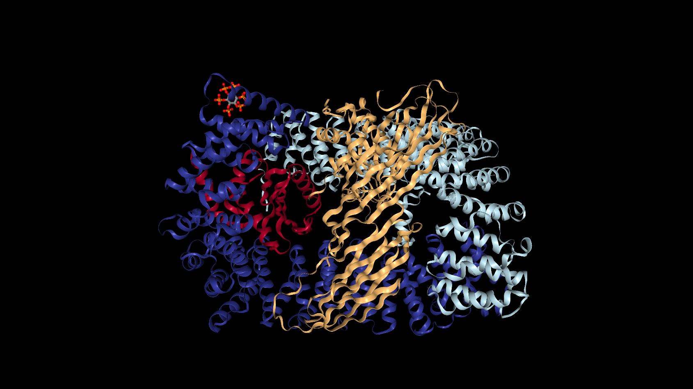
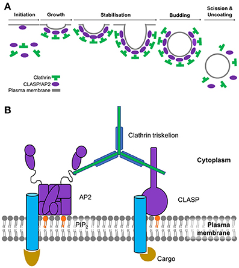

```{r setup, echo=FALSE, warning=FALSE, message=FALSE}
knitr::opts_chunk$set(echo = FALSE)
```


## Abstract

A short linear motif (SLiM) is a recurring pattern of approximately three to ten amino acids found in proteins. SLiMs are important for cellular signaling and the regulating of proteins, often times by acting as binding sites for protein-binding domains. While SLiMs exist both in ordered regions of proteins where there is a tertiary structure and in disordered regions where there is no structure, they are primarily functional in disordered regions. An important example of SLiM-mediated processes and the focus of this study is endocytosis. Endocytosis is the process by which cells engulf molecules from the extracellular environment. There are specific motifs that mediate and trigger endocytosis. However, the short length of motifs means that it is easy to overlook those that may be important to biological functions. The goal of this study is to identify previously unrecognized proteins that may be involved in endocytosis by analyzing the distribution of motifs in the ordered and disordered regions of the human proteome. Using a bioinformatics approach, we systematically searched the entire human proteome for motifs known to be involved in endocytosis. We hypothesize that the proteins we find to be enriched with motifs in disordered regions may be functionally important for endocytosis. These proteins will be targeted for experimental validation. 

## Introduction

Endocytosis is the process by which cells engulf molecules from the extracellular environment. Clathrin-mediated endocytosis (CME) is a fundamental cellular pathway by which transmembrane receptors and their cargo are taken up into intracellular compartments (8). CME uses two main proteins, clathrin and AP2, to create clathrin-coated vesicles that transport cargo (8). This process uses AP2 (shown in Figure 1) to assemble these vesicles. The proposed clathrin-mediated endocytic pathway is depicted in Figure 2 (8). 

```{r pressure, echo=TRUE, warning=FALSE, message=FALSE, fig.cap="Figure 1: The AP2 Protein Adaptor Complex, colored by its subunits: AP2A, AP2B1, AP2S1, AP2M1 (7)", out.width = '75%'}

```

```{r, echo=TRUE, warning=FALSE, message=FALSE, fig.cap="Figure 2A: Steps of the clathrin-coated pit formation (8). Figure 2B: The major players in the initiation of CME. The cargo binds to its respective transmembrane receptor, which AP2 then binds to in order to create a bridge to  clathrin (8).", out.width = '75%'}

```

<br>

Short linear motifs are short stretches of about three to ten amino acids. There are specific motifs that mediate and trigger endocytosis. These motifs are found in membrane receptor cytoplasmic tails. Previous studies have found that motifs are primarily functional in disordered regions, i.e. regions that lack a tertiary structure, of such proteins (12). Sometimes motifs do occur in ordered protein regions, but such motifs are generally not functional. Motifs can have a variable sequence because they often contain so-called "wildcards" where multiple amino acids can be recognized. More specifically, the motif $YXX[LIMFV]$ is read as Y then any two amino acids, then any one of the five amino acids in the LIMFV group enclosed in square brackets (this amino acid group can also be represented by the $\Phi$ symbol). Certain motifs play a specific role in CME. For example, the AP2 complex is known to recognize the $YXX\Phi$ and $X[DE]XXXL[LI]$ endocytic signal motifs within transmembrane cargoes (11). These motifs are responsible for the transport of membrane proteins and their cargo, while the motif $NPXY$ attracts clathrin and AP2 (6). These motifs have wildcards as previously mentioned. 

The goal of this study is to identify proteins that may be involved in endocytosis by analyzing the presence of CME motifs across the human proteome. We hypothesize that proteins that are enriched for CME motifs in disordered regions, relative to ordered regions, may play an unrecognized role in CME. Proteins that we detect will be experimentally tested for possible endocytotic functionality. 
 
## Results

### Background


First, we decided to focus on the following motifs based on their known activity in endocytosis and validation by the Eukaryoutic Linear Motif Database (ELM): $X[DE]XXXL[LI]$, $YXX[LIMFV]$, $NPXY$, $FXDX[LIMFV]$, $DX[FW]$, $[ST]XXXX[LI]$ and $NPF$ (3). The motifs $X[DE]XXXL[LI]$, $YXX[LIMFV]$, $NPXY$, and $NPF$ were further validated by Pandey's research(6).

We then examined the distributions of the named motifs across ordered vs. disordered regions in proteins known to be involved with CME (shown in Table 2). These proteins are the five subunits of the AP2 protein (AP2A1, AP2A2, AP2B1, AP2S1 and AP2M1) and AAK1, the AP2-associated kinase (2). 

Finally, we searched the human proteome for all instances of these motifs to see how their distributions compare to the distributions seen in CME proteins. 


<br>


Motif  |  Known Function  | Reference
| ---------- |:------------------------:| --------------------------:|
| $YXX[LIMFV]$ | This endocytic motif is a sorting signal that interacts with the AP2M1 subunit of the Adaptor Protein complex. It also directs the traffic of the endosomal and secretory pathways. | http://elm.eu.org/elms/TRG_ENDOCYTIC_2 |
| $X[DE]XXXL[LI]$ | This targeting motif is responsible for the sorting and internalization signals that direct transmembrane proteins from the cell surface. It interacts with AP2 which we know is involved in endocytosis at the plasma membrane. | http://elm.eu.org/elms/TRG_LysEnd_APsAcLL_1 |
| $[ST]XXXX[LI]$ | This is a cyclin docking motif that acts as a substrate recognition site for cyclin, thereby increasing phosphorylation by cyclin/Cdk complexes.  | http://elm.eu.org/elms/DOC_CYCLIN_RxL_1 |
| $FXDX[LIMFV]$  | This motif is an alpha appendage binding sequence found in proteins that are needed for clathrin coat assembly. It mediates the binding of amphipysin, AP180 and synaptojanin170 to the alpha subunit of AP2. | http://elm.eu.org/elms/LIG_AP2alpha_1 |
| $DX[FW]$  | This motif binds the appendage of the alpha and beta subunits of AP2, thus allowing for their recruitment to the site for the formation of the clathrin coated pit in endocytosis. | http://elm.eu.org/elms/LIG_AP2alpha_2 |
| $NPXY$  | This motif is a Phosphotyrosine binding (PTB) domain that binds to a phosphorylated version of NPXY. Hence, this motif is strongly associated with endocytic signalling. | http://elm.eu.org/elms/LIG_PTB_Apo_2 |
| $NPF$  | This motif is responsible for binding to the Eps15 homology (EH) domain. EH domains are only found in endocytic proteins and proteins involved in vesicular trafficking and are therefore believed to regulate these processes. | http://elm.eu.org/elms/LIG_EH_1 |

Table 1 shows us the motifs we chose to focus on, their known function, and the reference where the function was found.  

<br>

|Protein Name (UNIPROT ID)| Known Active Motif | Observed Motif Count (Disordered/Ordered) |
| ------------ |:----------:| :---------------:|
|AP2A1 (O95782) | $X[DE]XXXL[LI]$ | 0/1 |
|AP2A1 (O95782)|  $YXX[LIMFV]$ | 0/1 |
|AP2A1 (O95782)|  $[ST]XXXX[LI]$ | 3/1 |
|AP2A1 (O95782)|  $DX[FW]$ | 1/1 |
|AP2A2 (O94973)|  $X[DE]XXXL[LI]$ | 0/1 | 
|AP2A2 (O94973)|  $YXX[LIMFV]$ | 0/1 |
|AP2A2 (O94973)|  $[ST]XXXX[LI]$ | 5/2 |
|AP2A2 (O94973)|  $DX[FW]$ | 1/1 |
|AP2B1 (P63010)|  $X[DE]XXXL[LI]$ | 0/1 |
|AP2B1 (P63010)|  $YXX[LIMFV]$ | 0/1 |
|AP2B1 (P63010)|  $[ST]XXXX[LI]$ | 1/1 |
|AP2B1 (P63010)|  $DX[FW]$ | 0/1 |
|AP2M1 (Q96CW1)|  $X[DE]XXXL[LI]$ | 0/1 | 
|AP2M1 (Q96CW1)|  $YXX[LIMFV]$ | 0/1 |
|AP2M1 (Q96CW1)|  $[ST]XXXX[LI]$ | 1/0 |
|AP2M1 (Q96CW1)|  $DX[FW]$ | 0/1 |
|AP2M1 (Q96CW1)|  $FXDX[LIMFV]$ | 0/1 | 
|AP2S1 (P53680)|  $YXX[LIMFV]$ | 0/3 |
|AAK1  (Q2M2I8)|  $X[DE]XXXL[LI]$ | 2/0 | 
|AAK1  (Q2M2I8)|  $YXX[LIMFV]$ | 0/1 |
|AAK1  (Q2M2I8)|  $[ST]XXXX[LI]$ | 16/1 | 
|AAK1  (Q2M2I8)|  $DX[FW]$ | 5/1 |

Table 2 shows us the AP2 subunit protein and associated kinase names and accession ID's, along with the count of instances in seven motifs that have also been determined to be involved in endocytosis. The counts are separated to represent disordered verus ordered regions of each protein.

<br>

```{r, echo=TRUE, warning=FALSE, message=FALSE}
library(tidyverse)
library(scales)
library(cowplot)
library(ggrepel)
library(ggpubr)

data <- read_csv("human_proteome_motifs_across_domains.csv")
endo_data <- read_csv("endocytosis_involved_proteins.csv")
data <- rename(data, UNIPROT_ID = sequence_id)
plot_active_motifs <- function(motif,numx,numy) {
  data %>%
    filter(UNIPROT_ID == "O95782" | UNIPROT_ID == "O94973" | UNIPROT_ID == "P63010" | UNIPROT_ID == "P53680" | UNIPROT_ID == "Q96CW1" | UNIPROT_ID == "Q2M2I8") %>%
    inner_join(endo_data, by = c('UNIPROT_ID')) %>%
    group_by(UNIPROT_ID,UNIPROT_name,motif_type,domain_type) %>%
    summarize(count = n()) %>%
    spread(domain_type, count) %>%
    replace_na(list(D = 0, O = 0))%>%
    filter(motif_type %in% c(motif)) %>%
    ggplot(aes(x = O, y = D)) + 
    scale_x_continuous("Ordered Motif Count", breaks = pretty_breaks(), limits = c(0,numx)) +
    scale_y_continuous("Disordered Motif Count", breaks = pretty_breaks(), limits = c(0,numy)) +
    geom_point(stat = "identity", size = 1) +
    geom_text_repel(aes(label=UNIPROT_name), size = 3) +
    geom_abline(color="red") + 
    theme(axis.title=element_text(size=10)) +
    ggtitle(motif)
}
  
active_ST_plot <- plot_active_motifs("[ST]XXXX[LI]",6, 60) 
active_DX_plot <- plot_active_motifs("DX[FW]", 6, 20)
active_FXDX_plot <- plot_active_motifs("FXDX[FILMV]", 4, 0.04)
active_NPF_plot <- plot_active_motifs("NPF", 0.04, 4)
active_XD_plot <- plot_active_motifs("X[DE]XXXL[LI]", 8, 8)
active_YXX_plot <- plot_active_motifs("YXX[LIMFV]", 14, 0.04)

plot_grid(active_ST_plot, active_DX_plot, active_FXDX_plot, active_NPF_plot, active_XD_plot, active_YXX_plot, labels = "auto", nrow = 2)
```

This plot shows the proteins and the number of endocytic motif instances in disordered regions compared to ordered regions. Proteins located above the red line are considered enriched in the disordered regions, those below the red line are considered enriched in the ordered regions, and those on the red line are not enriched in either region. This plot shows that the active endocytic proteins we chose to focus on are enriched in motif count in the ordered regions for the motifs $YXX[LIMFV]$ and $X[DE]XXL[LI]$ (with the exception of the AAK1 protein kinase which is enriched in motif count in the disordered regions for the $X[DE]XXXL[LI]$ motif). In the $[ST]XXXX[LI]$ all the proteins except the AP2B1 protein are enriched in the disordered regions. In the $DX[FW]$ motif, the AP2M1 and AP2B1 proteins are enriched in the ordered regions, while the AAK1 protein is enriched in the disordered region. Lastly, the AP2M1 protein is enriched in the ordered region for the $FXDX[LIMFV]$ motif. 

### Findings
In the Results section, we further show the top ten proteins that we have found to be enriched in the disordered regions for each motif, that is the proteins with the lowest count in the ordered regions compared to the disordered regions. Each table in this section is headed by the specific motif the table focuses on and has five columns to represent the following:

i. The protein name
ii. The UNIPROT accession ID for each protein enriched in the number of specified motifs in the disordered region
iii. The ratio of motif counts in the disordered versus ordered regions (column 4 and 5, respectively)
iv. Whether or not the protein has been validated and recorded in the Eukaryotic Linear Motif Database (3). 

The plot following each table represents a heatmap proteins organized by their distribution in the disordered and ordered regions for the several endocytic motifs. Each rectangle (or hexagon) is colored based on the number of proteins that have the respective number of motif instances in the ordered and disordered regions. The rectangles found above the green y=x line on each plot represent the proteins that are enriched for the motif in the disordered regions. These are the proteins that should be targeted based on our hypothesis. A different plotting function was used to display the results for the motif $[ST]XXXL[LI]$ for better visualization. 

<br>

```{r, echo=TRUE, warning=FALSE, message=FALSE}

data <- rename(data, sequence_id = UNIPROT_ID)
data %<>%
  group_by(sequence_id,domain_type,motif_type) %>%
  summarize(count = n()) %>%
  spread(domain_type, count) %>%
  replace_na(list(D = 0, O = 0)) %>%
  filter (D > 0)


filter_plot <- function(data,motif,numx,numy) {
  data %>%
    group_by(D,O) %>%
    tally() %>%
    mutate(xmin = O-0.5, ymin = D-0.5, xmax = xmin + 1, ymax = ymin+1) %>%
    ggplot() + 
    geom_rect(color = "white", aes(xmin = xmin, xmax = xmax, ymin = ymin, ymax = ymax, fill = n)) + 
    geom_text(color = "white", aes(x = (xmin+xmax)/2, y = (ymin+ymax)/2, label = n), size = 3) + 
    scale_x_continuous("Ordered Motif Count", breaks = 0:numx) +
    scale_y_continuous("Disordered Motif Count", breaks = 0:numy) +
    grids(linetype = "dashed") +
    scale_fill_continuous(name = "Protein Count")
}

filter_STplot <- function(data,motif,number,numx,numy) {
  data %>%
    ggplot(aes(x = O, y = D)) + 
    scale_x_continuous("Motif Count in Ordered Regions", breaks = pretty_breaks(n = numx), limits=c(0,numx)) +
    scale_y_continuous("Motif Count in Disordered Regions", breaks = pretty_breaks(n = numy), limits=c(0,numy)) +
    geom_hex(bins = number) +
    geom_abline(color="green") + 
    stat_binhex(aes(label=..count..), geom="text", bins=number, colour="white", size=2.5) +
    scale_fill_gradient(name = "Frequency",na.value=NA) +
    grids(linetype = "dashed")
}

```

<br>

##### In this section, the $YXX[LIMFV]$ motif was investigated. The $YXX\Phi$ motif is a sorting signal that interacts with the mu subunit of the Adaptor Protein complex. 


```{r, echo=TRUE, warning=FALSE, message=FALSE}
YXX <- filter(data, motif_type == "YXX[LIMFV]")
filter_plot(YXX, "YXX[LIMFV]", 10, 18) + geom_abline(color = "green")
```

This plot shows the distribution of $YXX[LIMFV]$ motif counts in the ordered versus disordered regions in proteins across the human proteome. For this motif, 12969 proteins were found to be enriched in the disordered region. These are the proteins found above the green y=x line, which looks to be majority of the proteins in the human proteome.

<br>

##### $YXX[LIMFV]$ table
| Protein name | UNIPROT accession ID | motif count in disordered regions | motif count in ordered regions | Recorded in Eukaryotic Linear Motif Database|
| :---------------- |:--------:|:--------:| :--------:| :---------------------------:|
| Insulin receptor substrate 2 | Q9Y4H2  | 17  | 1 | no |
| Insulin receptor substrate 1 | P35568  | 14  | 0 | no |
| Transport protein Sec24B | O95487  | 11  | 2 | no |
| Protein PRRC2A | P48634  | 10  | 0 | no |
| Mucin-16  | Q8WXI7  | 10  | 1 | no |
| R3H domain-containing protein 2 | B5MCU0  | 9  | 1 | no |
| Insulin receptor substrate 4 | O14654  | 9  | 1 | no |
| Microtubule-associated protein 1B | P46821 | 9  | 1 | no |
| Phosphoprotein associated with glycosphingolipid-enriched microdomains 1 | Q9NWQ8  | 9  | 0 | no |
| Receptor tyrosine-protein kinase erbB-3 | B3KWG5 | 8  | 1 | no |

This table displays the top ten proteins found to have the lowest motif count in ordered regions to disordered regions ratio. They represent the upper points on the plot above. The insulin receptor substrate isoforms represent three out of these top 10 enriched proteins. The IRS isoforms are associated with the Gene Ontology(GO) terms signal transduction and transmembrane receptor protein kinase adaptor activity, which is very interesting as CME activity takes place in the transmembrane receptor. 

<br>

##### In this section, the $NPF$ motif was investigated. This motif is responsible for binding to the Eps15 homology (EH) domain. EH domains are only found in endocytic proteins and believed to regulate endocytosis.

```{r, echo=TRUE, warning=FALSE, message=FALSE}
NPF <- filter(data, motif_type == "NPF")
filter_plot(NPF, "NPF", 3, 6) + geom_abline(color = "green")
```

This plot shows the distribution of $NPF$ motif counts in the ordered versus disordered regions in proteins across the human proteome. For this motif, 979 proteins were found to be enriched in the disordered region.

<br>

##### $NPF$ table
| Protein name | UNIPROT accession ID | motif count in disordered regions | motif count in ordered regions | Recorded in Eukaryotic Linear Motif Database|
| ----------------- |:--------:|:--------:| :--------:| :----------------------------:|
| Rabenosyn-5 | Q9H1K0  | 6  | 0 | yes, in Rabenosyn-5 which is an effector protein that plays a role in early endocytic membrane fusion* |
| EH domain-binding protein 1 | Q8NDI1  | 5  | 0 | yes, in EH domain-binding protein 1 which links clathrin-mediated endocytosis to the actin cytoskeleton* |
| Disabled homolog 2 | P98082  | 4  | 0 | no |
| Synaptojanin-1 | A0A0D9SGJ6  | 3  | 0 | no |
| Protein kinase C and casein kinase substrate in neurons protein 2 | A0A0U1RR22  | 3  | 0 | no |
| Rab11 family-interacting protein 5 | A0A1B0GTL5  | 3  | 0 | no |
| Arf-GAP domain and FG repeat-containing protein 1 | B8ZZY2 | 3  | 0 | no |
| Secretory carrier-associated membrane protein | H3BN93 | 3  | 0 | no |
| Epsin-1 | Q9Y6I3  | 3  | 0 | yes, in Epsin-1 which assists in the formation of the clathrin-coated pit for endocytosis* |
| Epsin-2 | O95208 | 3  | 0  | yes, in Epsin-2 which plays a role in the formation of clathrin-coated pit* |

This table displays the top ten proteins found to have the lowest motif count in ordered regions to disordered regions ratio. Four of these proteins are recorded in the Eukaryotic Linear Motif (ELM) database. The Epsin-1 and Epsin-2 proteins are known to play a role in the formation of the clathrin-coated pit for CME, and the EH domain-binding protein is known to link CME to the cytoskeleton. These are promising results that may support our hypothesis. 

<br>

##### In this section, the $X[DE]XXXL[LI]$ motif was investigated. This is a targeting motif that is responsible for the sorting and internalization signals that interact with AP2. 

```{r, echo=TRUE, warning=FALSE, message=FALSE}
XD <- filter(data, motif_type == "X[DE]XXXL[LI]")
filter_plot(XD, "X[DE]XXXL[LI]", 10, 18) + geom_abline(color = "green")
```

This plot shows the distribution of $X[DE]XXXL[LI]$ motif counts in the ordered versus disordered regions in proteins across the human proteome. For this motif, 7841 protein were found to be enriched in the disordered regions. 

<br>

##### $X[DE]XXXL[LI]$ table
| Protein name | UNIPROT accession ID | motif count in disordered regions | motif count in ordered regions | Recorded in Eukaryotic Linear Motif Database|
| ----------------- |:--------:|:--------:| :--------:| :----------------------------:|
| Trichohyalin | Q07283  | 14  | 1 | no |
| Uncharacterized protein FLJ40521 | Q8N7P7  | 12  | 0 | no |
| Golgin subfamily A member 6-like protein 4 | A6NEF3  | 11  | 0 | no |
| Coiled-coil domain-containing protein 136 | Q96JN2  | 11  | 0 | no |
| Mucin-17 | E7EPM4  | 9  | 0 | no |
| Putative golgin subfamily A member 6-like protein 3 | A6NEY3  | 7  | 0 | no |
| Myosin-7B | A0A087X0T3  | 6  | 0 | no |
| Mucin-4 | A0A0G2JQI2  | 6  | 0 | no |
| Janus kinase and microtubule-interacting protein 1 | F2Z2K5 | 6  | 0 | no |
| Sciellin | O95171 | 6  | 0 | no |

This table displays the top ten proteins found to have the lowest motif count in ordered regions to disordered regions ratio. None of these proteins can be found in the Eukaryotic Linear Motif (ELM) database for this motif. However, the coiled-coil domain-containing protein 136 (CCDC136) is associated with the transmembrane domain GO term. This is a promising factor because we know that CME activity occurs in transmembrane receptors. 

<br>

##### In this section, the $NPXY$ motif was investigated. This is a motif that acts as a Phosphotyrosine binding (PTB) domain to bind to a phosphorylated motif. 

```{r, echo=TRUE, warning=FALSE, message=FALSE}
NPXY <- filter(data, motif_type == "NPXY")
filter_plot(NPXY, "NPXY", 10, 18)
```

This plot shows the distribution of $NPXY$ motif counts in the ordered versus disordered regions in proteins across the human proteome. For this motif, 776 proteins were found to be enriched in the disordered regions. Compared to the other motif plots, this motif occurs the least number of times in the human proteome. 

<br>

##### $NPXY$ table
| Protein name | UNIPROT accession ID | motif count in disordered regions | motif count in ordered regions | Recorded in Eukaryotic Linear Motif Database|
| ----------------- |:--------:|:--------:| :--------:| :----------------------------:|
| Receptor protein-tyrosine kinase | E9PFD7  | 3  | 0 | no |
| Transmembrane channel-like protein | F5GYU8  | 3  | 0 | no |
| Calreticulin | K7EJB9  | 3  | 0 | no |
| Calmegin | O14967  | 3  | 0 | no |
| Receptor protein-tyrosine kinase | B4DTR1 | 2  | 0 | no |
| Centrosomal protein of 41 kDa | F8WAV3 | 2  | 0 | no |
| MAM and LDL-receptor class A domain-containing protein 1 | H0Y3D6 | 2  | 0 | no |
| Phosphatidylinositol 3,4,5-trisphosphate 5-phosphatase 1 | H0Y5Q9 | 2  | 0 | no |
| Integrin beta-1 | H7C4K3 | 2  | 0 | no | 
| Protein CASC3 | O15234 | 2  | 0 | no | 

This table displays the top ten proteins found to have the lowest count in ordered regions to disordered regions ratio. Although none of these proteins are recorded in the Eukaryotic Linear Motif (ELM) database, a number of them are associated with GO terms that are interesting to this study. For example, the two receptor protein-tyrosine kinases (found in different genes) are associated with the transmembrane receptor activity GO term. While Calmegin and the transmembrane channel-like protein are associated with the transmembrane domain, which we know is the site of CME activity. 

<br>

##### In this section, the $FXDX[LIMFV]$ motif was investigated. The $FXDX\Phi$ motif mediates the binding of amphipysin, AP180 and synaptojanin170 to the alpha subunit of AP2 (necessary for clathrin coat assembly).

```{r, echo=TRUE, warning=FALSE, message=FALSE}
FXDX <- filter(data, motif_type == "FXDX[FILMV]")
filter_plot(FXDX, "FXDX[FILMV]", 3, 6) + geom_abline(color = "green")
```

This plot shows the distribution of $FXDX[LIMFV]$ motif counts in the ordered versus disordered regions in proteins across the human proteome. For this motif, 2400 proteins were found to be enriched in the disordered region. 

<br>

##### $FXDX[LIMFV]$ table
| Protein name | UNIPROT accession ID | motif count in disordered regions | motif count in ordered regions | Recorded in Eukaryotic Linear Motif Database|
| :---------------- |:--------:|:--------:| :--------:| :---------------------------:|
| WASH complex subunit 2A | A0A087WYF6 | 6 | 0 | no |
| WASH complex subunit 2C | A0A096LPC5 | 6 | 0 | no |
| WASH complex subunit 2D | Q5SRD0 | 4 | 0 | no |
| Zinc finger protein 40 | F5H212 | 3 | 0 | no |
| Clathrin coat assembly protein AP180 | O60641 | 3 | 1 | yes, there are 3 recorded in the clathrin coat assembly protein AP180* |
| Casein kinase II subunit alpha | A0A087WY74 | 2 | 0 | no |
| G-protein-signaling modulator 1 | A0A0A0MRC4 | 2 | 0 | no |
| Syntaxin-1A | A0A0C4DFZ1 | 2 | 0 | no |
| DnaJ homolog subfamily B member 6 | A0A0J9YX62 | 2 | 0 | no |
| Protein FAM193A | A0A1B0GVL4 | 2 | 0 | no |

This table shows the top ten proteins found to have the lowest motif count in ordered regions compared to disordered regions ratio. The most interesting protein here is the clathrin coat assembly protein AP180, which as the name suggests, plays a key role in the formation of the clathrin coated pit for CME. 


<br>


##### In this section, the $DX[FW]$ motif was investigated. This motif binds the appendage of the alpha and beta subunits of AP2, thus allowing for their recruitment to the site for the formation of the clathrin coated pit in endocytosis.

```{r, echo=TRUE, warning=FALSE, message=FALSE}
DX <- filter(data, motif_type == "DX[FW]")
filter_plot(DX, "DX[FW]", 4, 25) + geom_abline(color = "green")
```

This plot shows the distribution of $DX[FW]$ motif counts in the ordered versus disordered regions in proteins across the human proteome. For this motif, 10597 proteins were found to be enriched in the disordered region. 

<br>

##### $DX[FW]$ table
| Protein name | UNIPROT accession ID | motif count in disordered regions | motif count in ordered regions | Recorded in Eukaryotic Linear Motif Database|
| :---------------- |:--------:|:--------:| :--------:| :---------------------------:|
| Epidermal growth factor receptor substrate 15-like 1 | Q9UBC2 | 23 | 0 | yes, there are 20 instances recorded; this protein seems to be a component of endocytic clathrin-coated pits and involved in endocytosis of integrin beta-1 and transferrin receptor. |
| WASH complex subunit 2A | A0A087WYF6 | 22 | 0 | no |
| WASH complex subunit 2C | A0A096LPC5 | 21 | 0 | no |
| Epidermal growth factor receptor substrate 15 | P42566 | 17 | 2 | yes, there are 15 instances recorded; this protein plays multiple roles in clathrin-mediated endocytosis* |
| Clathrin coat assembly protein AP180 | E9PDG8| 13 | 0 | no |
| Histone-lysine N-methyltransferase 2D | O14686 | 11 | 1 | no |
| Disabled homolog 2 | P98082 | 10 | 1 | yes, there are 2 instances recorded; it is an adaptor protein that acts as a clathrin-associated sorting protein.* |
| Epsin-1 | Q9Y6I3 | 10 | 0 | no |
| WASH complex subunit 2D | Q5SRD0 | 8 | 0 | no |
| Eukaryotic translation initiation factor 3 subunit A | Q14152 | 7 | 1 | no |


This table displays the top ten proteins found to have the lowest motif count in ordered regions to disordered regions ratio. The epidemeral growth factor receptor substrate 15 protein, disabled homolog 2 protein, and clathrin coat assembly protein AP180 are all known to play a role in CME.

<br>

##### In this section, the $[ST]XXXX[LI]$ motif was investigated. This is a cyclin docking motif, thereby increasing phosphorylation by cyclin/Cdk complexes.

```{r, echo=TRUE, warning=FALSE, message=FALSE}
ST <- filter(data, motif_type == "[ST]XXXX[LI]")
filter_STplot(ST, "[ST]XXXX[LI]", 15, 10, 30)
```

This plot shows the distribution of $[ST]XXXX[LI]$ motif counts in the ordered versus disordered regions in proteins across the human proteome. Unlike the previous plots, this plot uses hexagons. Each hexagon is labeled with a white number representing the number of proteins that have the same number of motif instances in the ordered and disordered regions, while the green line is a one to one line used to determine which proteins are enriched in the disordered regions and should be targeted based on our hypothesis. For this motif, 31169 proteins were found to be enriched in the disordered regions.

<br>

##### $[ST]XXXX[LI]$ table
| Protein name | UNIPROT accession ID | motif count in disordered regions | motif count in ordered regions | Recorded in Eukaryotic Linear Motif Database|
| :---------------- |:--------:|:--------:| :--------:| :-----------------------------------:|
| Mucin-19 | Q7Z5P9 | 119 | 1 | no |
| Mucin-17 | E7EPM4 | 114 | 1 | no |
| Mucin-4 | A0A0G2JR46 | 72 | 0 | no |
| Kruppel-like factor 18 protein | A0A0U1RQI7 | 51 | 1 | no |
| Adenomatous polyposis coli protein | P25054 | 42 | 7 | no |
| Centromere protein F | P49454 | 39 | 1 | no |
| Proline and serine-rich protein 1 | Q86XN7 | 37 | 1 | no |
| Microtubule-associated protein 1A | E9PGC8 | 36 | 1 | no |
| Nuclear pore complex-interacting protein family member B5 | E7EUG2 | 35 | 2 | no |
| Regulation of nuclear pre-mRNA domain-containing protein 2 | Q5VT52 | 34 | 1 | no |

This table shows the top ten proteins found to have the lowest count in ordered regions compared to disordered regions for this motif. They represent the hexagons found most above the green line. Interestingly, none of these proteins were found to be associated with a GO term related to the transmembrane domain. However, this may suggest that these proteins play a role in CME outside of the transmembrane receptor region. 

<br>

## Conclusion 

Results do not support the hypothesis. The distribution of motifs in the disordered regions compared to the ordered regions are not always enriched in endocytic proteins as displayed in Table 2 and the first plot containing the details of the known AP2 adaptor complex proteins and their associated protein kinase, AAK1. To our surprise, the functions of the known endocytic proteins were not found in the Eukaryotic Linear Motif database. However, the literature confirms their involvement in clathrin-mediated endocytosis (2)(4)(5). One caveat of this study is that many of these motifs are overlapping, and are kinase recruiting. This means that there may be an overestimate of motif instances due to the overlap caused by the wildcards present in these motifs. Also, some proteins found to be enriched for certain motifs in their disordered regions may simply be signalling proteins for kinases that regulate endocytic functions, and do not play a role of their own in endocytosis. Future studies will look at the extent of the motif overlapping. A table of the proteins discovered to be enriched in their disordered regions for endocytic motifs is below. The proteins in each table that are not experimentally characterized with functional motifs according to the Eukaryotic Linear Motif (ELM) database are potentially novel candidate genes.

<br>

## References

1. Aasland, R., Abrams, C., Ampe, C., Ball, L. J., Bedford, M. T., Cesareni, G., . . . Winder, S. J. (2002). Normalization of nomenclature for peptide motifs as ligands of modular protein domains. FEBS Letters, 513(1), 141-144. doi:10.1016/s0014-5793(01)03295-1
2. Conner, S. D., & Schmid, S. L. (2002). Identification of an adaptor-associated kinase, AAK1, as a regulator of clathrin-mediated endocytosis. The Journal of Cell Biology, 156(5), 921-929. doi:10.1083/jcb.200108123
3. Diella, F., Via, A., Chica, C., Luck, K., Gould, C., & Gibson, T. (2009). The Eukaryotic Linear Motif Resource (ELM): Regulatory Sites in Proteins. Nature Precedings. doi:10.1038/npre.2009.3152.1
4. Kadlecova, Z., Spielman, S. J., Loerke, D., Mohanakrishnan, A., Reed, D. K., & Schmid, S. L. (2016). Regulation of clathrin-mediated endocytosis by hierarchical allosteric activation of AP2. The Journal of Cell Biology, 216(1), 167-179. doi:10.1083/jcb.201608071
5. Koscielny, A., Malik, A. R., Liszewska, E., Zmorzynska, J., Tempes, A., Tarkowski, B., & Jaworski, J. (2017). Adaptor Complex 2 Controls Dendrite Morphology via mTOR-Dependent Expression of GluA2. Molecular neurobiology, 55(2), 1590–1606. doi:10.1007/s12035-017-0436-3
6. Pandey, K. N. (2010). Small peptide recognition sequence for intracellular sorting. Current Opinion in Biotechnology, 21(5), 611-620. doi:10.1016/j.copbio.2010.08.007
7. RCSB Protein Data Bank. (n.d.). 4UQI. Retrieved April 10, 2019, from https://www.rcsb.org/3d-view/4UQI/1
8. Smith SM, Baker M, Halebian M and Smith CJ (2017) Weak Molecular Interactions in Clathrin-Mediated Endocytosis. Front. Mol. Biosci. 4:72. doi: 10.3389/fmolb.2017.00072
9. Tidyverse. (n.d.). Retrieved from https://www.tidyverse.org/
10. Github Motifs Repository.(n.d.). Retrieved from https://github.com/cbethell/motifs
11. (n.d.). Retrieved April 5, 2019, from https://www.genecards.org/cgi-bin/carddisp.pl?gene=AP2M1
12. Babu, M. M. (2016). The contribution of intrinsically disordered regions to protein function, cellular complexity, and human disease. Biochemical Society Transactions, 44(5), 1185-1200. doi:10.1042/bst20160172
13. UniProt: A worldwide hub of protein knowledge. (2018).Nucleic Acids Research,47(D1). doi:10.1093/nar/gky1049


